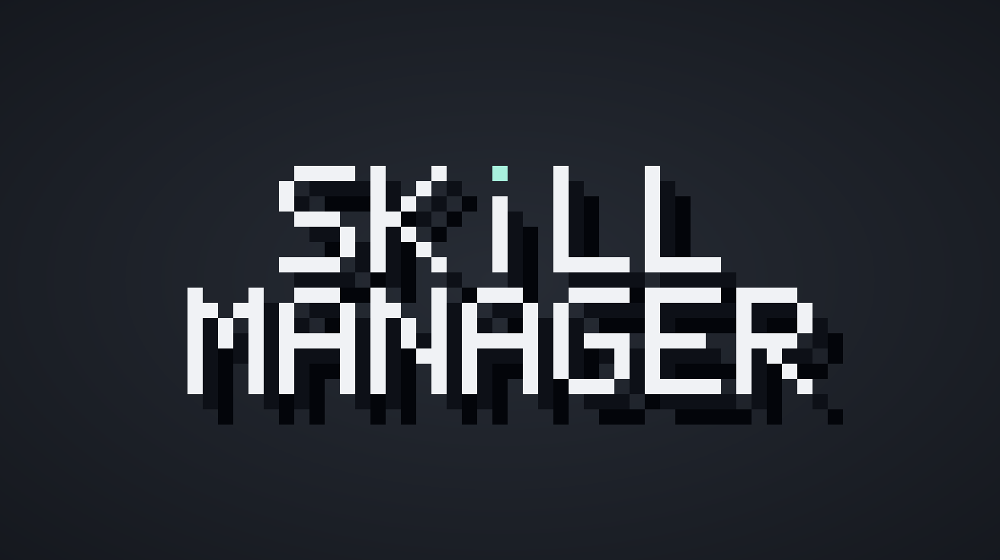
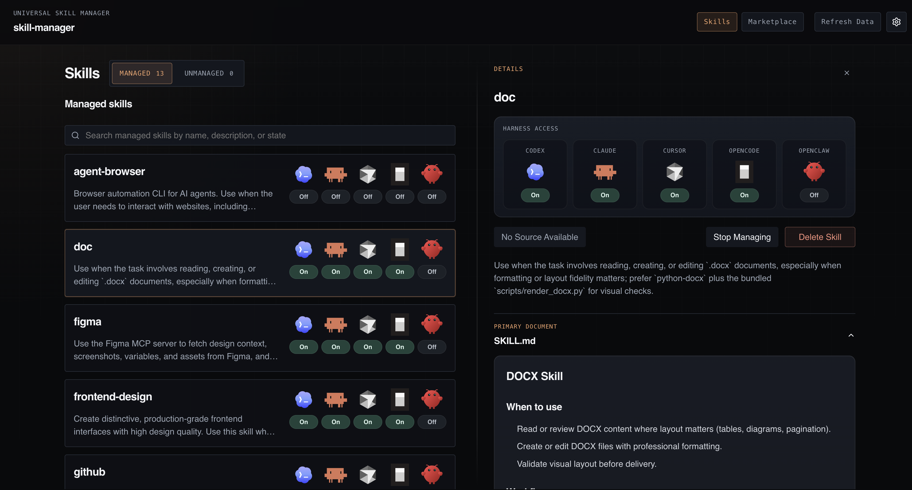
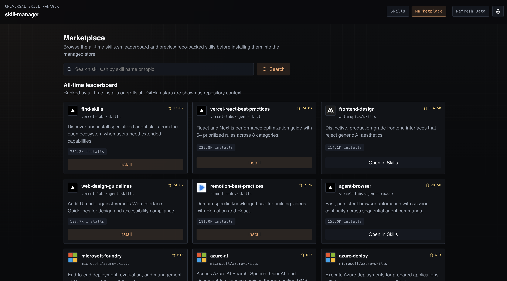
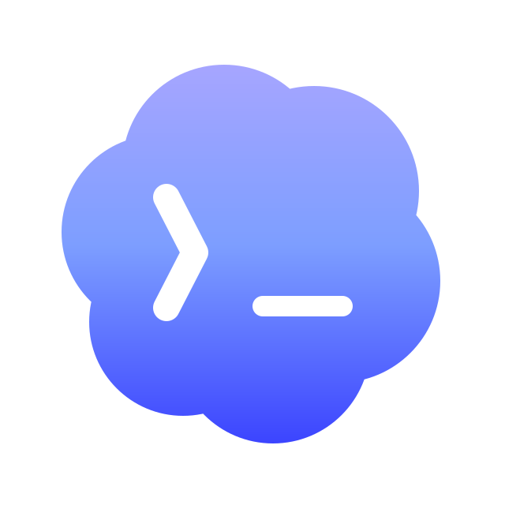
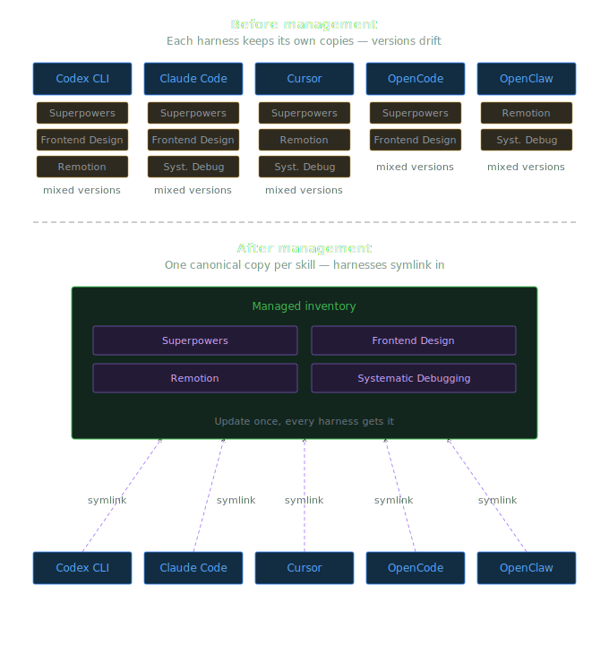

# skill-manager

<p align="center">
  
</p>


<p align="center">
  <a href="LICENSE"></a>
  <a href="https://github.com/mode-io/skill-manager/releases/tag/v0.1.0"></a>
  <a href="https://www.npmjs.com/package/@mode-io/skill-manager"></a>
  <a href="#install"></a>
  <a href="#install"></a>
  <a href="#safety"></a>
</p>

Manage AI skills across Codex, Claude, Cursor, OpenCode, and OpenClaw from one local app.

If you use more than one agent harness, skills end up scattered across different folders, install flows, and local states. `skill-manager` gives you one place to see what is installed, bring unmanaged skills under control, enable or disable skills per harness, and install new ones safely without turning your local setup into guesswork.

## Why skill-manager exists

- Skills get duplicated across multiple harness folders.
- Local skill copies drift out of sync and become hard to reason about.
- It is easy to lose track of what is managed, unmanaged, built in, or custom.
- Editing local skill directories by hand is risky when you are not sure which tool depends on which copy.

## What you can do

- Discover supported harnesses on your machine automatically.
- See managed and unmanaged skills in one inventory.
- Bring local unmanaged skills under management without losing visibility.
- Enable or disable managed skills per harness.
- Install new skills from the marketplace and open them directly in `Skills`.

## Product tour

<p align="center">
  
</p>

The `Skills` workspace gives you one place to review managed and unmanaged skills, inspect local state, and control harness access.

<p align="center">
  
</p>

The `Marketplace` view lets you browse, preview, and install new skills without leaving the app.

Typical flow:

1. Open `Skills` to see what is already installed across your supported harnesses.
2. Bring an unmanaged skill under management so it becomes part of one shared local inventory.
3. Enable that managed skill only for the harnesses you want.

## Install

### Homebrew (Recommended)

```bash
brew tap mode-io/tap
brew install skill-manager
skill-manager start
```

### npm

```bash
npm install -g @mode-io/skill-manager
skill-manager start
```

## Supported harnesses

<table align="center">
  <tr>
    <td align="center" valign="middle">
      <br />
      <strong>Codex CLI</strong><br />
      <a href="https://developers.openai.com/codex/cli">Docs</a>
    </td>
    <td align="center" valign="middle">
      <br />
      <strong>Claude Code</strong><br />
      <a href="https://code.claude.com/docs/en/overview">Docs</a>
    </td>
    <td align="center" valign="middle">
      <br />
      <strong>Cursor</strong><br />
      <a href="https://cursor.com/docs">Docs</a>
    </td>
    <td align="center" valign="middle">
      <br />
      <strong>OpenCode</strong><br />
      <a href="https://opencode.ai/docs">Docs</a>
    </td>
    <td align="center" valign="middle">
      <br />
      <strong>OpenClaw</strong><br />
      <a href="https://docs.openclaw.ai/start/getting-started">Docs</a>
    </td>
  </tr>
</table>

## Safety

`skill-manager` is a local-first desktop-style tool. It reads from, and can mutate, local harness skill directories on your machine.

Actions that change local state include:

- `Bring Under Management`
- enable or disable for managed harness links
- `Update From Source`
- `Stop Managing`
- `Delete Skill`
- marketplace installs into the managed local inventory

Use it like any other local configuration-management tool: point it at the correct skill roots, understand what is managed versus unmanaged, and review destructive actions before confirming them.

## How it works

Before you bring a skill under management, each harness just points at its own local copy. After you bring that skill under management, `skill-manager` stores one managed copy in its shared local inventory and rewires each supported harness to that shared copy with symlinks. That gives you one canonical package to update, disable, or delete while still controlling harness access individually.

<p align="center">
  
</p>

## From source

### Requirements

- Python 3.11+
- Node.js 18+
- npm

`skill-manager` supports Python 3.11+. CI validates backend compatibility on Python 3.11 through 3.14, while packaging and release builds stay pinned to Python 3.11 for determinism.

### Contributor setup

```bash
scripts/install-dev.sh
```

### Run locally

```bash
scripts/start-dev.sh
```

Stop the managed local instance:

```bash
scripts/stop-dev.sh
```

The traditional split dev flow is still available when you want Vite hot reload:

```bash
npm run dev
npm run dev:backend
```

If you stop the local dev app and want to bring it back:

```bash
scripts/start-dev.sh
```

If you are using the split dev flow instead, restart both sides:

```bash
npm run dev
npm run dev:backend
```

Default local URLs:

- Frontend: `http://127.0.0.1:5173`
- Backend: `http://127.0.0.1:8000`
- Health: `http://127.0.0.1:8000/api/health`

## Configuration

By default, `skill-manager` resolves harness paths from `HOME` and `XDG_CONFIG_HOME`. You can override individual roots with environment variables.

### Codex

- `SKILL_MANAGER_CODEX_ROOT`
- `SKILL_MANAGER_CODEX_GLOBAL_ROOT`

### Claude

- `SKILL_MANAGER_CLAUDE_ROOT`
- `SKILL_MANAGER_CLAUDE_GLOBAL_ROOT`

### Cursor

- `SKILL_MANAGER_CURSOR_ROOT`
- `SKILL_MANAGER_CURSOR_GLOBAL_ROOT`

### OpenCode

- `SKILL_MANAGER_OPENCODE_ROOT`
- `SKILL_MANAGER_OPENCODE_GLOBAL_ROOT`
- `SKILL_MANAGER_OPENCODE_BUILTINS`

### OpenClaw

- `SKILL_MANAGER_OPENCLAW_CONFIG`

These overrides are useful when your harness skill directories or OpenClaw config file live outside the defaults.

## Development

Useful local commands:

```bash
scripts/install-dev.sh
npm run typecheck
bash scripts/test_backend.sh
npm test
npm run build
./.venv/bin/python -m skill_manager serve --host 127.0.0.1 --port 8000 --no-open-browser
scripts/ci_validate.sh
```

Test coverage currently includes:

- frontend unit tests
- backend unit and integration tests
- Playwright smoke coverage

## Community

- See [CONTRIBUTING.md](CONTRIBUTING.md) for contribution guidelines.
- See [SECURITY.md](SECURITY.md) to report vulnerabilities privately.

## Limitations

- This is a local-first app, not a hosted service.
- Source-backed operations are currently centered on GitHub-backed skills.
- Marketplace content is sourced from `skills.sh`.
- Public distribution is currently macOS-only.

## Project status

This repository is in active development as the public `skill-manager` project, with npm and Homebrew distribution backed by native release artifacts.
