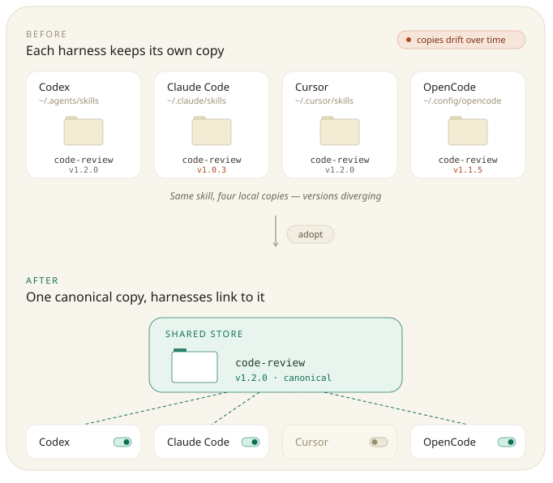
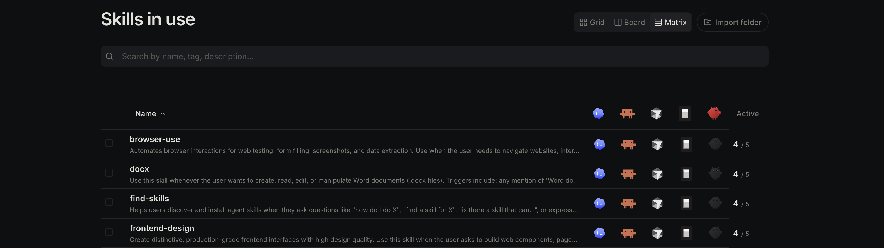
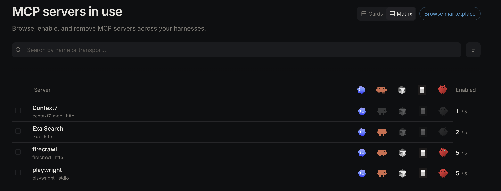
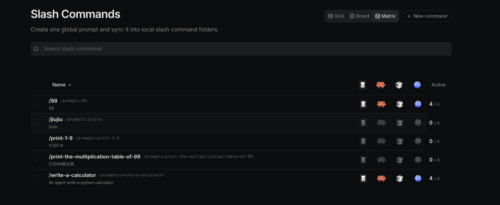
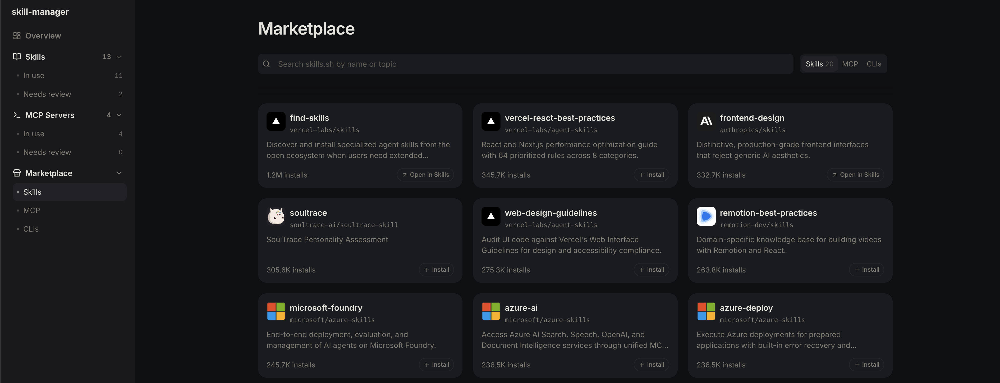
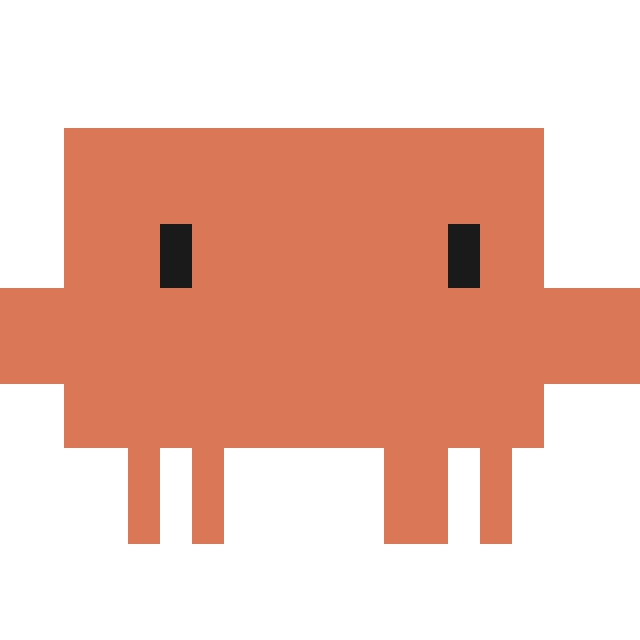
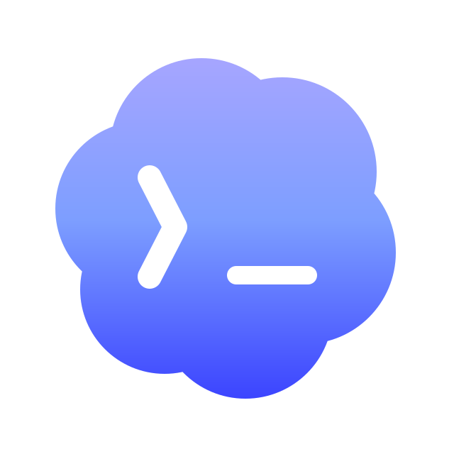
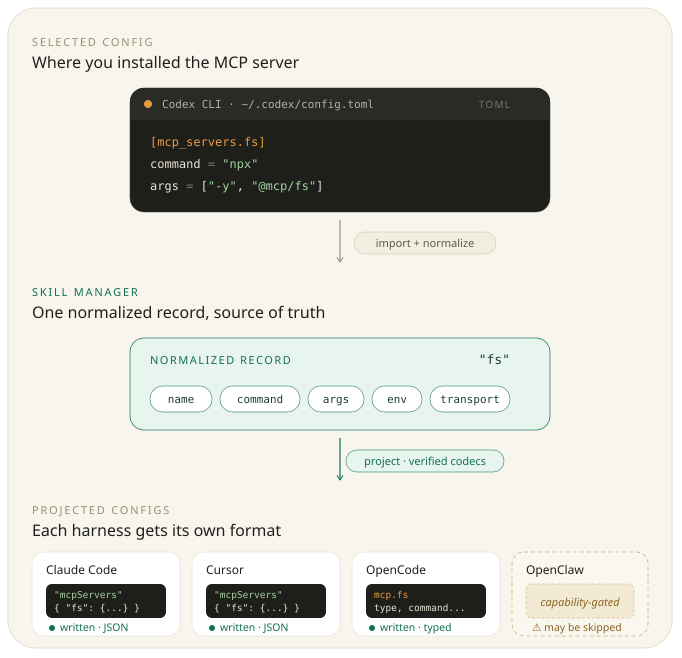

# skill-manager

<p align="center">
  
</p>

<p align="center">
  <strong>A local-first control center for AI extensions.</strong><br />
  Use, review, and discover Skills, Agents, MCP servers, slash commands, hooks, and CLI tools across agent harnesses.
</p>

<p align="center">
  <a href="LICENSE"></a>
  <a href="https://github.com/mode-io/skill-manager/releases/latest"></a>
  <a href="https://www.npmjs.com/package/@mode-io/skill-manager"></a>
  <a href="#install"></a>
  <a href="#install"></a>
  <a href="#local-first-safety"></a>
</p>



## Why it exists

AI extensions are scattered across harness-specific folders, MCP config files, slash command locations, and marketplace sources. Skill Manager gives those pieces one local control surface:

| Product idea | What it means |
|---|---|
| **In use** | Skill Manager controls the item and can enable or disable it across harnesses. |
| **Needs review** | Skill Manager found local state, config differences, or inventory issues that need a decision. |
| **Discover** | Browse marketplaces and preview external tools. |

## What you can do

- See what is in use, what needs review, and where extensions are active.
- Adopt local Skills into one shared inventory, then enable or disable them per harness.
- Install or adopt MCP server configs, resolve differences, and enable them where supported.
- Manage reusable slash commands once, then sync them to supported harnesses.
- Manage hooks as normalized records, then sync them into supported harness settings with drift detection and review for unmanaged entries.
- Manage Agents — agents are markdown files in the store that get symlinked into each harness's agents directory, with In Use and Needs Review views like every other family.
- Keep everything in portable packages: the default `local` package holds your own resources, and additional packages can be dropped in (or deactivated) as a unit.
- Discover Skills, MCP servers, and preview-only CLI tools from marketplace sources.

## Product tour

### Overview

Start with the whole extension portfolio: what is in use, what needs review, what can be discovered, and where extensions are active.


### Skills

Use Skills as shared local packages instead of maintaining separate copies per harness.

Typical flow:

1. Review a Skill found in a harness or install one from the marketplace.
2. Adopt it into the Skill Manager inventory.
3. Enable it only where it should be available.
4. Update, remove, or delete it from one place.



### MCP servers

Use MCP servers as one normalized config that can be written into each harness shape.

Typical flow:

1. Review an MCP server found in a harness or install one from the marketplace.
2. Adopt it into the Skill Manager inventory.
3. Enable it where the server should be available.
4. Resolve config differences, disable harness bindings, or uninstall it from one place.



### Slash commands

Use slash commands as one shared prompt library instead of rewriting the same command in each harness-specific format.

Typical flow:

1. Create a slash command with a name, description, and prompt.
2. Use `$ARGUMENTS` where runtime input should be inserted.
3. Sync it to supported harnesses.
4. Review existing harness command files and adopt them into the shared library when needed.



### Agents

Subagents you keep in one place instead of copy-pasting between harnesses.

Typical flow:

1. Write an agent — a name, a description, and a system prompt — or adopt one Skill Manager found in a harness.
2. Turn it on for the harnesses that should have it.
3. Review agents discovered in harness directories and adopt the ones worth keeping.

### Marketplace

Marketplace is the discovery surface:

- **Skills Marketplace**: browse and install Skills.
- **MCP Marketplace**: browse and install MCP servers.
- **CLI Marketplace**: preview external CLI tools from CLIs.dev. This is display-only; Skill Manager does not install or manage CLIs.



## Install

### Homebrew (macOS recommended)

```bash
brew tap mode-io/tap
brew install skill-manager
skill-manager start
```

### npm (macOS ARM64/x64 and Linux x64/ARM64)

```bash
npm install -g @mode-io/skill-manager
skill-manager start
```

The npm wrapper downloads the native release artifact for the current platform and CPU architecture.
Native release artifacts are published on GitHub Releases for macOS ARM64/x64 and Linux x64/ARM64.

## Supported harnesses

<table align="center">
  <tr>
    <td align="center" valign="middle">
      <br />
      <strong>Claude Code</strong><br />
      <a href="https://code.claude.com/docs/en/overview">Docs</a>
    </td>
    <td align="center" valign="middle">
      <br />
      <strong>Codex CLI</strong><br />
      <a href="https://developers.openai.com/codex/cli">Docs</a>
    </td>
    <td align="center" valign="middle">
      <br />
      <strong>Antigravity (agy)</strong><br />
      <a href="https://antigravity.google">Docs</a>
    </td>
    <td align="center" valign="middle">
      <br />
      <strong>Cursor</strong><br />
      <a href="https://cursor.com/docs">Docs</a>
    </td>
    <td align="center" valign="middle">
      <br />
      <strong>OpenCode</strong><br />
      <a href="https://opencode.ai/docs">Docs</a>
    </td>
    <td align="center" valign="middle">
      <br />
      <strong>Hermes Agent</strong><br />
      <a href="https://hermes-agent.nousresearch.com/docs">Docs</a>
    </td>
    <td align="center" valign="middle">
      <br />
      <strong>OpenClaw</strong><br />
      <a href="https://docs.openclaw.ai/start/getting-started">Docs</a>
    </td>
  </tr>
</table>

Harnesses appear in this order everywhere in the app — Settings, and every resource
matrix. The order is declared once, in `SUPPORTED_HARNESS_DEFINITIONS`
(`skill_manager/harness/catalog.py`); every family derives its columns from it, so there
is no per-page ordering to keep in sync. A harness switched off in Settings is dropped
from every matrix rather than shown as an inert column.

| Harness | Skills | MCP servers | Slash commands | Hooks |
|---|---:|---:|---:|---:|
| Codex CLI | Yes | Yes | Yes | Yes |
| Claude Code | Yes | Yes | Yes | Yes |
| Cursor | Yes | Yes | Yes | Yes |
| OpenCode | Yes | Yes | Yes | Partial |
| Hermes Agent | Yes | Yes | Yes* | Not Yet |
| OpenClaw | Yes | Not Yet | Not Yet | Not Yet |
| Antigravity (agy) | Yes | Yes | Not Yet | Partial |

<sub>\* Hermes Agent slash-command support is provisional. Its slash-command directory (`~/.hermes/commands`, frontmatter Markdown) follows common conventions but is **not yet verified against a shipping Hermes build**; hooks are not yet mapped. See `handoff.md`.</sub>

## Local-first safety

Skill Manager is a local configuration-management tool. It runs on your machine and reads or writes local harness extension state.

Actions that can change local state include:

- adopting a local skill folder
- enabling or disabling a skill for a harness
- updating a source-backed skill
- removing or deleting a skill
- installing an MCP server into a selected harness config
- adopting an existing MCP config
- enabling, disabling, resolving, or uninstalling an MCP server
- creating, updating, syncing, importing, or deleting a slash command
- creating, enabling, disabling, resolving, or deleting a hook binding
- changing harness support settings

App-owned files live under `~/.skill-manager` on macOS (with a legacy fallback to `~/Library/Application Support/skill-manager` if it already exists) and XDG base directories on Linux.

## How it works

### Packages

All Skill Manager resources live inside packages under the app's `packages/` directory. Each package carries a `package.json` (`slug`, `name`, `version`, `mutable`, `active`) plus per-family content (`skills/`, `agents/`, and a skills `manifest.json`). There is always a default `local` package — the mutable workspace where your own resources live. Additional packages are just directories: drop one in to install it, set `active: false` to disable it, and mark it `mutable: false` to protect shared content from accidental edits (the API rejects writes into immutable packages).

Resource identity stays stable (content-derived refs), while `<package>/<resource>` aliases give human-readable references; agent compilation resolves aliases and pins them. If two packages provide the same resource, the `local` package wins and the collision is reported as an inventory issue.

On first start after upgrading, the legacy shared store (`shared/` + top-level `manifest.json`) is migrated one-time into `packages/local/` — the migration is locked, idempotent, and skipped when the new layout already exists.

### Skills

Before adoption, each harness points at its own local skill folder. After adoption, Skill Manager keeps one canonical package in its shared local store and exposes it to selected harnesses with local links. Disabling a harness removes that harness binding without deleting the package.

Skill Manager treats managed Skills as portable by default: once a Skill is adopted into the shared store, it can be enabled for any supported harness. `originHarness` is retained only as provenance.

Hermes Agent Skills use the categorized Hermes layout under `~/.hermes/skills/<category>/<skill>/SKILL.md`. Shared Skills enabled for Hermes are linked under the `skill-manager` category by default. Skill Manager only imports Hermes Skills that Hermes itself installed from external hub provenance (`.hub/lock.json` entries that are not official/builtin/optional). Hermes self-learned/local Skills, bundled Skills tracked by `.bundled_manifest`, and official optional Skills recorded in Hermes hub provenance are excluded from Skill Manager inventory and bulk actions; Skill Manager leaves those folders untouched so `hermes update` and Hermes-owned Skill sync keep their normal ownership.


### MCP servers

MCP servers are stored as normalized Skill Manager records, then translated into the config shape each harness expects:

- Codex uses TOML under `mcp_servers`.
- Claude Code and Cursor use `mcpServers` JSON entries.
- OpenCode uses typed local/remote MCP entries.
- Antigravity (agy) uses `mcpServers` JSON entries with `serverUrl` for HTTP transports and `command`/`args`/`env` for stdio.
- Hermes Agent uses YAML under `mcp_servers` in `~/.hermes/config.yaml` (or `$HERMES_HOME/config.yaml`).
- OpenClaw MCP writes are not yet supported.

When Skill Manager finds different configs for the same MCP server, it asks you to resolve the source of truth first.



### Slash commands

Slash commands are stored as TOML records under Skill Manager app storage, then rendered into each supported harness format:

- Claude Code writes Markdown command files under `~/.claude/commands` and invokes them with `/`.
- Codex writes prompt files under `~/.codex/prompts` and invokes them with `/prompts:`.
- Cursor writes plain text command files under `~/.cursor/commands` and invokes them with `/`.
- OpenCode writes Markdown command files under `~/.config/opencode/commands` and invokes them with `/`.
- Hermes Agent writes Markdown command files under `~/.hermes/commands` and invokes them with `/` (provisional).
- OpenClaw and Antigravity (agy) slash command writes are not yet supported.

Disabling a harness in Settings removes its column here immediately, without a restart.
Command files already written to that harness and their sync records are left alone —
re-enabling it restores the column and its sync state unchanged.

Skill Manager tracks target ownership with sync state and content hashes. It will not overwrite an untracked command file automatically, and it reports managed files as changed or missing when the target no longer matches the last synced hash. Review actions let you adopt unmanaged commands, restore managed content, adopt a changed harness command as the new source, or remove a broken binding while leaving the harness file untouched.

### Hooks

Hooks are stored as normalized Skill Manager records using **canonical events** (`pre_tool_use`, `post_tool_use`, `user_prompt_submit`, `session_start`, `stop`, `pre_compact`) and **canonical tool categories** (`shell`, `file_read`, `file_write`, `mcp`, `web`, `any`). Each harness codec translates a canonical record into that harness's native event names and config shape, and merges it into the harness's hook config:

- Claude Code writes hook entries into `~/.claude/settings.json` under the `hooks` key.
- Codex writes inline `[hooks]` tables into `~/.codex/config.toml` (same event schema as Claude).
- Cursor writes `~/.cursor/hooks.json`, expressing each tool category as its dedicated event (`beforeShellExecution`, `afterFileEdit`, `beforeMCPExecution`, and so on).
- OpenCode writes `experimental.hook` entries in `opencode.json` — limited to `file_edited` (post-edit on write) and `session_completed` (stop), so coverage is partial.
- Antigravity (agy) writes a name-keyed `~/.gemini/config/hooks.json`, matching against its own tool names (`run_command`, `view_file`, …); it covers tool, stop, and (via `PreInvocation`) prompt-submit hooks, so coverage is partial.

Because harnesses differ, not every canonical event maps to every harness. Skill Manager exposes a **representability matrix** showing where each hook can sync and where it cannot, including caveats — for example, an Antigravity `user_prompt_submit` hook maps to `PreInvocation`, which fires before every model invocation rather than only on prompt submit.

Skill Manager owns only the specific hook entries it writes. It merges into each harness's config without disturbing hooks or other keys it does not manage, and it tracks ownership with content hashes. When a managed hook is edited outside Skill Manager it is reported as drifted, and hooks found in a harness that Skill Manager does not manage are reported as unmanaged for review.

### Agents

Agents are Markdown files with YAML frontmatter and the system prompt as the body. They live in Skill Manager's store; enabling one for a harness symlinks it into that harness's agents directory, so editing the agent once updates it everywhere it is enabled.

Skill Manager reads `name`, `description`, and `tools`, and **leaves every other frontmatter key alone**. Harness agents routinely carry settings we have no business interpreting — Claude's `model`, `permissionMode`, `maxTurns`, `hooks`; Cursor's `readonly` and `is_background`; Codex's `sandbox_mode` — so an edit merges into the original frontmatter rather than re-rendering it, and unrecognized keys survive untouched. The detail view lists them verbatim under **Configuration**, which means a new harness field shows up without any code change here. The only keys dropped on write are `capabilities:` and `harnesses:` from the retired compile model, which nothing reads.

The agents matrix shows the same harnesses as every other family — whichever you have enabled in Settings:

| Harness | Location | How it is installed |
|---|---|---|
| Claude Code | `~/.claude/agents/` | symlink |
| Cursor | `~/.cursor/agents/` | symlink |
| Antigravity | `~/.gemini/antigravity-cli/agents/` | symlink |
| OpenCode | `$XDG_CONFIG_HOME/opencode/agents/` | symlink |
| Codex | `~/.codex/agents/` | rendered TOML |
| Hermes | — | not installable |

Most harnesses read the same Markdown format the store holds, so enabling one symlinks the store file into place — edit the agent once and every harness it is enabled for follows. **Codex** is the exception: it reads TOML with different keys (`name`, `description`, `developer_instructions`), so Skill Manager renders a real file marked `# skill-manager:generated`. Rendered files carry no drift detection — re-enabling overwrites local edits to them. **Hermes** keeps a column for consistency but spawns subagents dynamically and has no agent-definition file to install into, so its cells say so rather than offering a toggle that cannot work.

Skill Manager only ever removes files it owns — a symlink into its store, or a file carrying its generated marker. Anything else in a harness's agents directory is reported as **unmanaged** for review, never overwritten. Adopting one moves it into the store (converting Codex TOML to Markdown) and installs it back. If the name is already taken in the store, Skill Manager refuses to guess and asks which version to keep.

### CLIs

CLI marketplace entries are preview-only.

## Configuration

On macOS, app-owned files live under `~/.skill-manager` (with a legacy fallback to `~/Library/Application Support/skill-manager` if it already exists). On Linux, app-owned files use XDG base directories.

Useful macOS paths:

- packages root: `~/.skill-manager/packages` (default package: `packages/local`)
- shared skills store: `~/.skill-manager/packages/local/skills` (migrated from the legacy `~/.skill-manager/shared` on first start)
- agents: `~/.skill-manager/packages/<package>/agents`
- MCP manifest: `~/.skill-manager/mcp/manifest.json`
- hooks manifest: `~/.skill-manager/hooks/manifest.json`
- slash command library: `~/.skill-manager/slash-commands/commands`
- slash command sync state: `~/.skill-manager/slash-commands/sync-state.json`
- marketplace cache: `~/.skill-manager/marketplace`
- app database: `~/.skill-manager/skill-manager.db`
- app settings: `~/.skill-manager/settings.json`

Useful Linux paths:

- packages root: `${XDG_DATA_HOME:-~/.local/share}/skill-manager/packages`
- shared skills store: `${XDG_DATA_HOME:-~/.local/share}/skill-manager/packages/local/skills`
- agents: `${XDG_DATA_HOME:-~/.local/share}/skill-manager/packages/<package>/agents`
- MCP manifest: `${XDG_DATA_HOME:-~/.local/share}/skill-manager/mcp/manifest.json`
- hooks manifest: `${XDG_DATA_HOME:-~/.local/share}/skill-manager/hooks/manifest.json`
- slash command library: `${XDG_DATA_HOME:-~/.local/share}/skill-manager/slash-commands/commands`
- slash command sync state: `${XDG_DATA_HOME:-~/.local/share}/skill-manager/slash-commands/sync-state.json`
- marketplace cache: `${XDG_DATA_HOME:-~/.local/share}/skill-manager/marketplace`
- app settings: `${XDG_CONFIG_HOME:-~/.config}/skill-manager/settings.json`

Most users do not need to change these locations. If you manage skills in a custom environment, you can override individual skill roots with environment variables.

| Harness | Env var | Default Skill Manager skill root |
|---|---|---|
| Codex | `SKILL_MANAGER_CODEX_ROOT` | `~/.agents/skills` |
| Claude | `SKILL_MANAGER_CLAUDE_ROOT` | `~/.claude/skills` |
| Cursor | `SKILL_MANAGER_CURSOR_ROOT` | `~/.cursor/skills` |
| OpenCode | `SKILL_MANAGER_OPENCODE_ROOT` | `~/.config/opencode/skills` |
| Hermes Agent | `SKILL_MANAGER_HERMES_ROOT` | `${HERMES_HOME:-~/.hermes}/skills` |
| OpenClaw | `n/a` | `~/.openclaw/skills` |
| Antigravity (agy) | `SKILL_MANAGER_AGY_ROOT` | `~/.gemini/antigravity-cli/skills` |

MCP config locations are harness-owned. Skill Manager writes only to verified config paths and skips unsupported harness writes. Hermes Agent config discovery honors `SKILL_MANAGER_HERMES_HOME` first, then `HERMES_HOME`, then `~/.hermes`.

## From source

### Requirements

- Python 3.11+
- Node.js 18+
- npm

`skill-manager` supports Python 3.11+. CI validates backend compatibility on Python 3.11 through 3.14, while packaging and release builds stay pinned to Python 3.11 for determinism.

### Contributor setup

```bash
scripts/install-dev.sh
```

### Run locally

```bash
scripts/start-dev.sh
```

Stop the managed local instance:

```bash
scripts/stop-dev.sh
```

The split dev flow is available when you want Vite hot reload:

```bash
npm run dev
npm run dev:backend
```

Default local URLs:

- Frontend: `http://127.0.0.1:5173`
- Backend: `http://127.0.0.1:8000`
- Health: `http://127.0.0.1:8000/api/health`

The server binds to loopback only, and it rejects requests with a non-loopback `Host` header
(DNS-rebinding protection) and mutations with a non-loopback `Origin` header (CSRF protection).
Binding a non-loopback address requires an explicit opt-in, and is discouraged because the API
has no authentication:

```bash
skill-manager serve --host 0.0.0.0 --allow-remote
```

Validation:

```bash
scripts/install-dev.sh
npm run typecheck
bash scripts/test_backend.sh
npm test
npm run build
```

## Troubleshooting

- If Marketplace requests fail with `Marketplace is temporarily unavailable`, verify your network connection and try again.
- On macOS, if `npm install -g @mode-io/skill-manager` reports that Homebrew already owns `skill-manager`, uninstall the Homebrew formula first. The inverse also applies: uninstall the npm package before switching back to Homebrew.
- If an MCP harness is shown as unavailable, Skill Manager has detected that the local client is missing or does not support the required config surface.

## More to come

### Extension families

- [x] Hook support
- [x] Slash command support
- [x] Agent personas
- [x] Package-based storage (portable resource bundles)
- [ ] Plugin support

### Harness expansion

- [ ] GitHub Copilot
- [ ] Gemini CLI
- [ ] Cline
- [ ] Windsurf
- [ ] Qwen Code
- [ ] Kimi Code
- [ ] Qoder

## Community

- See [CONTRIBUTING.md](CONTRIBUTING.md) for contribution guidelines.
- See [SECURITY.md](SECURITY.md) to report vulnerabilities privately.
